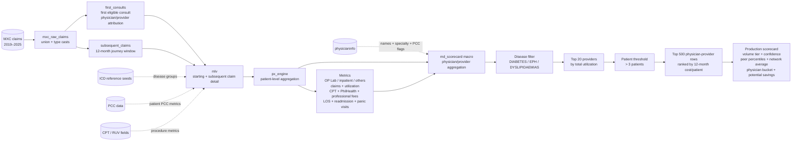
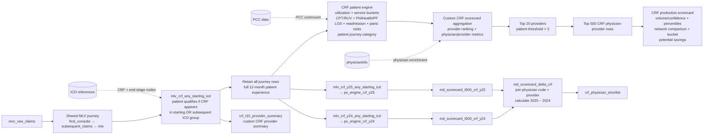
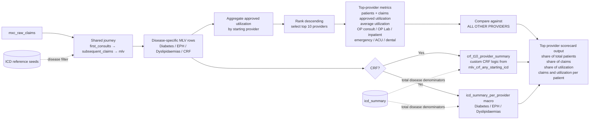
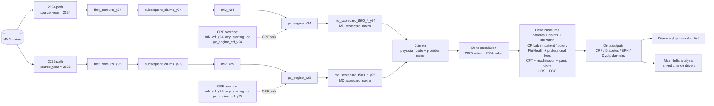

# Scorecard Data-Flow Charts

Charts reflect current dbt model and macro dependencies. Arrows show transformation order; dashed arrows show reference/enrichment inputs.

## 1. MD scorecards — Diabetes, EPH, Dyslipidaemias

## 2. CRF MD scorecard — separate path

## 3. Top provider scorecards

## 4. Delta MD scorecards — 2024 vs 2025

## Model map

| Chart | Primary dbt models/macros |
|---|---|
| MD scorecards | `mxc_raw_claims`, `first_consults`, `subsequent_claims`, `mlv`, `px_engine`, `md_scorecard`, production scorecard models |
| CRF MD scorecard | `mlv_crf_any_starting_icd`, `px_engine_crf_y24`, `px_engine_crf_y25`, `md_scorecard_t500_crf_any_starting_icd`, CRF production model |
| Top provider scorecards | `icd_summary_per_provider`, `crf_t10_provider_summary`, disease `*_t10_provider_summary` models |
| Delta MD scorecards | year-specific `mlv`, `px_engine`, `md_scorecard_t500_*_y24`, `md_scorecard_t500_*_y25`, `md_scorecard_delta_*` |
